 

# **Unit Deliverable #0 - Classes Review**

Welcome to your first Java project in CS112! Take this project as an opportunity to brush up on CS111 concepts and skills, filling in any gaps you have so that we can all go into Unit 1 feeling more prepared and ready to learn the new material for this course. Keep in mind, **everyone** has gaps! There are plenty of times I have to Google something really quick to remind myself, but after doing this so many years those usually are only small reminders. At the start of your CS career, those search sessions are gonna be longer, hunting for the pieces you need to keep going. That's ok!

The point of this project is not a "GOTCHA!" or anything sinister. It really is to have something tangible to review CS111, and what better way than the foundation of sooooo many games. Playing cards! Whether it's Spades, Conquian, Poker, or BlackJack, whether they're played at a BBQ or _carne asada_, what all of these card games have in common is the standard playing card. What a great example of **Abstraction**!

For UD0, you are given `CardTester.java`, a tester class that contains a main method running a slew of tests to make sure that the most fundamental component of these games, the `Card` class, is bulletproof. Make sure to read the documentation in both the `CardTester.java` and `Card.java` files, when you're ready to start testing some code uncomment Line 22 in `Main.java` to run the tester. Take it slow, get one test working at a time (see screenshots and breakdown below). Once you've gotten the code to pass all the tests, create a driver program that will create a 52 `Card` array to simulate a deck. Then print out all of the cards in the deck to ensure it is finally working as expected.

**TL;DR/To-Do List:**

- Read through Java files, carefully and thoroughly
- Implement one method at a time, uncommenting one test at a time until you solve it and it works.
- Repeat until all tests pass
- Create a driver that generates a deck of 52 Card objects and prints it out

**The following are screenshots of the working tests for your reference, along with some additional notes:**

Notice the difference between the output if there is no default constructor built vs. if there is. The screenshot below is when the default constructor is NOT built yet, only the `toString`. The `[]` (square brackets) are to indicate the start and end of the `toString` return value:
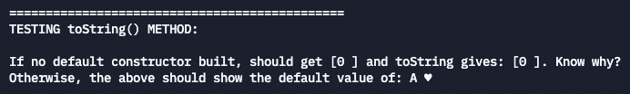
 

Notice that the setter returns the appropriate boolean value, and that when the setter returns false there is no change since the last successful mutation:
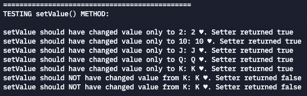
 

Notice that the setter returns the appropriate boolean value, and that when the setter returns false there is no change since the last successful mutation:
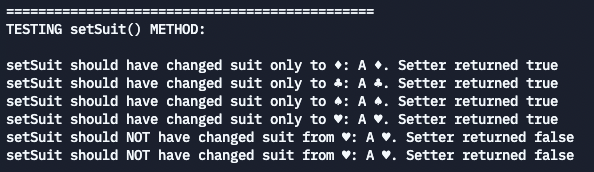

 

Notice that the setter returns the appropriate boolean value, and that when the setter returns false there is no change since the last successful mutation:
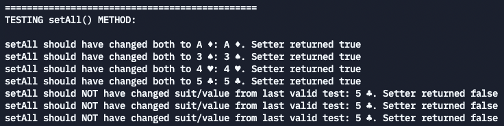

 

Remember the `toString` test? Once you complete the default constructor (which is much easier once you've completed the `setAll` method), you can scroll back to the `toString` test and see the change. Now it actually shows the default value!
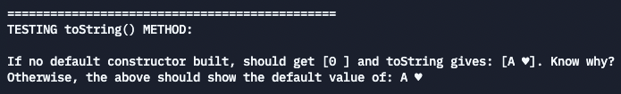

 

Full constructor test should create the following cards. To test the error scenario, uncomment the code as noted and your program should exit the program after printing an error message. Bad data should not be allowed in!
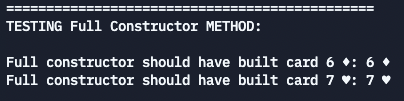
 

Copy constructor should work similarly as well. To test the error scenario, uncomment the code as noted and your program should exit the program after printing an error message. Bad data should not be allowed in! See if you can answer the question (hint: check the CS111 PDF on copy constructors for some help):
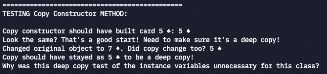
 

Getter should simply return the unicode char of the suit (assuming default constructor is working):

 

Getter should simply return the integer value (not A but 1) of the card (assuming default constructor is working):
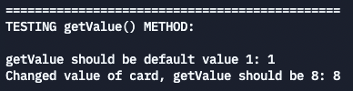

 

This version of the getter for value should work appropriately for the letters that are on the printed card:
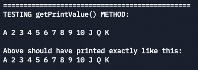

 

Notice all combinations of mismatching data are tested:
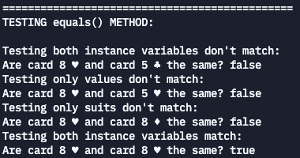
 

**Driver screenshot example:**

For the driver, you can simply print the contents of the array by looping it and printing the `toString` method call. As long as you print all of the cards (each suit/value together) you can print them in whatever order you'd like.

Here's one example that's slightly more challenging, printing the cards in 13 per row:
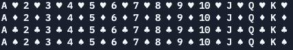
 

Want an extra challenge (make sure this is **after** getting all of the above working)?

## **HACKER CHALLENGE!** 

> Barbara Gordon (Oracle) in The Oracle Code graphic novel by Marieke Nijkamp and Manuel Prietano (image from TheMarySue.com)

Use the ASCII art in `Card` class methods to get the following working (hint: you'll want to use the `getPrintCard` method 😃)
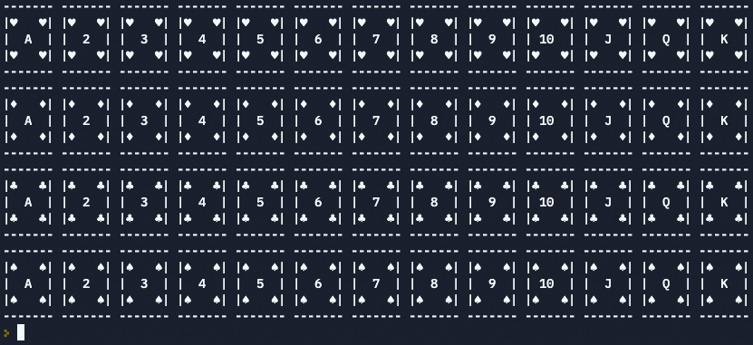
 

**_Good luck!!!_** 
