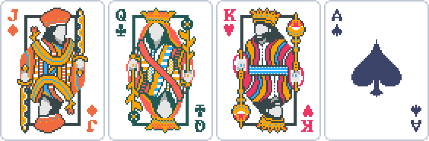

# **Unit Deliverable 0 - Classes Review**


> Art from Balatro, LocalThunk/Playstack, 2024. Profe Soto's screenshot

Welcome to your first Java project in CS112! Take this project as an opportunity to brush up on CS111 concepts and skills, filling in any gaps you have so that we can all go into Unit 1 feeling more prepared and ready to learn the new material for this course. The point of this project is to have something tangible to review CS111, and what better way than the foundation of so many games. **Playing cards**! Whether it's Spades, Conquian, Poker, or BlackJack, whether they're played at a BBQ or _carne asada_, what all of these card games have in common is the standard playing card.

For UD0, you are given `CardTester.java`, a tester class that contains a main method running a slew of tests to make sure that the most fundamental component of these games, the `Card` class, is bulletproof. Make sure to read the documentation in both the `CardTester.java` and `Card.java` files, when you're ready to start testing some code uncomment Line 22 in `Main.java` to run the tester. Take it slow, get one test working at a time (see screenshots and breakdown below). Once you've gotten the code to pass all the tests, create a driver program that will create a 52 `Card` array to simulate a deck. Then print out all of the cards in the deck to ensure it is finally working as expected.

**TL;DR/To-Do List:**

- Read through Java files, carefully and thoroughly
- Implement one method at a time, uncommenting one test at a time until you solve it and it works.
- Repeat until all tests pass
- Create a driver that generates a deck of 52 Card objects and prints it out

**The following are screenshots of the working tests for your reference, along with some additional notes:**

Notice the difference between the output if there is no default constructor built vs. if there is. The screenshot below is when the default constructor is NOT built yet, only the `toString`. The `[]` (square brackets) are to indicate the start and end of the `toString` return value:
```
==============================================
TESTING toString() METHOD:

If no default constructor built, should get [0 ] and toString gives: [0 ]. Know why?
Otherwise, the above should show the default value of: A ♥
```

Notice that the setter returns the appropriate boolean value, and that when the setter returns false there is no change since the last successful mutation:
```
==============================================
TESTING setValue() METHOD:

setValue should have changed value only to 2: 2 ♥. Setter returned true
setValue should have changed value only to 10: 10 ♥. Setter returned true
setValue should have changed value only to J: J ♥. Setter returned true
setValue should have changed value only to Q: Q ♥. Setter returned true
setValue should have changed value only to K: K ♥. Setter returned true
setValue should NOT have changed value from K: K ♥. Setter returned false
setValue should NOT have changed value from K: K ♥. Setter returned false
```


Notice that the setter returns the appropriate boolean value, and that when the setter returns false there is no change since the last successful mutation:
```
==============================================
TESTING setSuit() METHOD:

setSuit should have changed suit only to ♦: A ♦. Setter returned true
setSuit should have changed suit only to ♣: A ♣. Setter returned true
setSuit should have changed suit only to ♠: A ♠. Setter returned true
setSuit should have changed suit only to ♥: A ♥. Setter returned true
setSuit should NOT have changed suit from ♥: A ♥. Setter returned false
setSuit should NOT have changed suit from ♥: A ♥. Setter returned false
```


Notice that the setter returns the appropriate boolean value, and that when the setter returns false there is no change since the last successful mutation:
```
==============================================
TESTING setAll() METHOD:

setAll should have changed both to A ♦: A ♦. Setter returned true
setAll should have changed both to 3 ♠: 3 ♠. Setter returned true
setAll should have changed both to 4 ♥: 4 ♥. Setter returned true
setAll should have changed both to 5 ♣: 5 ♣. Setter returned true
setAll should NOT have changed suit/value from last valid test: 5 ♣. Setter returned false
setAll should NOT have changed suit/value from last valid test: 5 ♣. Setter returned false
setAll should NOT have changed suit/value from last valid test: 5 ♣. Setter returned false
```

Remember the `toString` test? Once you complete the default constructor (which is much easier once you've completed the `setAll` method), you can scroll back to the `toString` test and see the change. Now it actually shows the default value!
```
==============================================
TESTING toString() METHOD:

If no default constructor built, should get [0 ] and toString gives: [A ♥]. Know why?
Otherwise, the above should show the default value of: A ♥
```

Full constructor test should create the following cards. To test the error scenario, uncomment the code as noted and your program should exit the program after printing an error message. Bad data should not be allowed in!
```
==============================================
TESTING Full Constructor METHOD:

Full constructor should have built card 6 ♦: 6 ♦
Full constructor should have built card 7 ♥: 7 ♥
```

Copy constructor should work similarly as well. To test the error scenario, uncomment the code as noted and your program should exit the program after printing an error message. Bad data should not be allowed in! See if you can answer the question (hint: check the CS111 PDF on copy constructors for some help):
```
==============================================
TESTING Copy Constructor METHOD:

Copy constructor should have built card 5 ♠: 5 ♠
Look the same? That's a good start! Need to make sure it's a deep copy!
Changed original object to 7 ♦. Did copy change too? 5 ♠
Copy should have stayed as 5 ♠ to be a deep copy!
Why was this deep copy test of the instance variables unnecessary for this class?

```

Getter should simply return the unicode char of the suit (assuming default constructor is working):
```
==============================================
TESTING getSuit() METHOD:

getSuit should be default suit ♥: ♥
Changed suit of card, getSuit should be ♠: ♠
```

Getter should simply return the integer value (not A but 1) of the card (assuming default constructor is working):
```
==============================================
TESTING getValue() METHOD:

getValue should be default value 1: 1
Changed value of card, getValue should be 8: 8
```

This version of the getter for value should work appropriately for the letters that are on the printed card:
```
TESTING getPrintValue() METHOD:

A 2 3 4 5 6 7 8 9 10 J Q K 

Above should have printed exactly like this:
A 2 3 4 5 6 7 8 9 10 J Q K
```


Notice all combinations of mismatching data are tested:
```
==============================================
TESTING equals() METHOD:

Testing both instance variables don't match:
Are card 8 ♥ and card 5 ♣ the same? false
Testing only values don't match:
Are card 8 ♥ and card 5 ♥ the same? false
Testing only suits don't match:
Are card 8 ♥ and card 8 ♦ the same? false
Testing both instance variables match:
Are card 8 ♥ and card 8 ♥ the same? true
```

**Driver screenshot example:**

For the driver, you can simply print the contents of the array by looping it and printing the `toString` method call. As long as you print all of the cards (each suit/value together) you can print them in whatever order you'd like.

Here's one example that's slightly more challenging, printing the cards in 13 per row:
```
A ♥ 2 ♥ 3 ♥ 4 ♥ 5 ♥ 6 ♥ 7 ♥ 8 ♥ 9 ♥ 10 ♥ J ♥ Q ♥ K ♥ 
A ♦ 2 ♦ 3 ♦ 4 ♦ 5 ♦ 6 ♦ 7 ♦ 8 ♦ 9 ♦ 10 ♦ J ♦ Q ♦ K ♦ 
A ♣ 2 ♣ 3 ♣ 4 ♣ 5 ♣ 6 ♣ 7 ♣ 8 ♣ 9 ♣ 10 ♣ J ♣ Q ♣ K ♣ 
A ♠ 2 ♠ 3 ♠ 4 ♠ 5 ♠ 6 ♠ 7 ♠ 8 ♠ 9 ♠ 10 ♠ J ♠ Q ♠ K ♠ 
```

Want an extra challenge (make sure this is **after** getting all of the above working)?

## **HACKER CHALLENGE!**
Use the ASCII art in `Card` class methods to get the following working (hint: you'll want to use the `getPrintCard` method).
```
------- ------- ------- ------- ------- ------- ------- ------- ------- ------- ------- ------- ------- 
|♥   ♥| |♥   ♥| |♥   ♥| |♥   ♥| |♥   ♥| |♥   ♥| |♥   ♥| |♥   ♥| |♥   ♥| |♥   ♥| |♥   ♥| |♥   ♥| |♥   ♥| 
|  A  | |  2  | |  3  | |  4  | |  5  | |  6  | |  7  | |  8  | |  9  | | 10  | |  J  | |  Q  | |  K  | 
|♥   ♥| |♥   ♥| |♥   ♥| |♥   ♥| |♥   ♥| |♥   ♥| |♥   ♥| |♥   ♥| |♥   ♥| |♥   ♥| |♥   ♥| |♥   ♥| |♥   ♥| 
------- ------- ------- ------- ------- ------- ------- ------- ------- ------- ------- ------- ------- 
------- ------- ------- ------- ------- ------- ------- ------- ------- ------- ------- ------- ------- 
|♦   ♦| |♦   ♦| |♦   ♦| |♦   ♦| |♦   ♦| |♦   ♦| |♦   ♦| |♦   ♦| |♦   ♦| |♦   ♦| |♦   ♦| |♦   ♦| |♦   ♦| 
|  A  | |  2  | |  3  | |  4  | |  5  | |  6  | |  7  | |  8  | |  9  | | 10  | |  J  | |  Q  | |  K  | 
|♦   ♦| |♦   ♦| |♦   ♦| |♦   ♦| |♦   ♦| |♦   ♦| |♦   ♦| |♦   ♦| |♦   ♦| |♦   ♦| |♦   ♦| |♦   ♦| |♦   ♦| 
------- ------- ------- ------- ------- ------- ------- ------- ------- ------- ------- ------- ------- 
------- ------- ------- ------- ------- ------- ------- ------- ------- ------- ------- ------- ------- 
|♣   ♣| |♣   ♣| |♣   ♣| |♣   ♣| |♣   ♣| |♣   ♣| |♣   ♣| |♣   ♣| |♣   ♣| |♣   ♣| |♣   ♣| |♣   ♣| |♣   ♣| 
|  A  | |  2  | |  3  | |  4  | |  5  | |  6  | |  7  | |  8  | |  9  | | 10  | |  J  | |  Q  | |  K  | 
|♣   ♣| |♣   ♣| |♣   ♣| |♣   ♣| |♣   ♣| |♣   ♣| |♣   ♣| |♣   ♣| |♣   ♣| |♣   ♣| |♣   ♣| |♣   ♣| |♣   ♣| 
------- ------- ------- ------- ------- ------- ------- ------- ------- ------- ------- ------- ------- 
------- ------- ------- ------- ------- ------- ------- ------- ------- ------- ------- ------- ------- 
|♠   ♠| |♠   ♠| |♠   ♠| |♠   ♠| |♠   ♠| |♠   ♠| |♠   ♠| |♠   ♠| |♠   ♠| |♠   ♠| |♠   ♠| |♠   ♠| |♠   ♠| 
|  A  | |  2  | |  3  | |  4  | |  5  | |  6  | |  7  | |  8  | |  9  | | 10  | |  J  | |  Q  | |  K  | 
|♠   ♠| |♠   ♠| |♠   ♠| |♠   ♠| |♠   ♠| |♠   ♠| |♠   ♠| |♠   ♠| |♠   ♠| |♠   ♠| |♠   ♠| |♠   ♠| |♠   ♠| 
------- ------- ------- ------- ------- ------- ------- ------- ------- ------- ------- ------- ------- 
```

**_Good luck!!!_**
